# Gym App

This application allows users to check in at nearby gyms, view their check-in history, and search for gyms by name. Additionally, administrators can validate check-ins and register new gyms.

## 🚀Technologies

- [x] [Fastify](https://fastify.io)
- [x] [Prisma](https://prisma.io)
- [x] [PostgreSQL](https://www.postgresql.org)
- [x] [bcryptjs](https://www.npmjs.com/package/bcryptjs)
- [x] [JWT](https://jwt.io)
- [x] [Zod](https://github.com/colinhacks/zod)
- [x] [Day.js](https://day.js.org)
- [x] [Docker](https://docker.com)
- [x] [Vitest](https://vitest.dev)

## Application Flow

In this flow, we present the steps for authentication, check-in, check-in validation, gym search, and obtaining metrics.



## Running the application

<details>
<summary>Setting up the environment</summary>

### Setting up the environment

Make sure you have [Node.js](https://nodejs.org), [Docker](https://docker.com), and [Docker Compose](https://docs.docker.com/compose/install/) installed on your system.

1. Cloning the repository

   ```bash
   git clone https://github.com/your-username/gym-app.git
   cd gym-app
   ```

2. Installing dependencies

   ```bash
   npm install
   ```

3. Configuring environment variables

   > Copy the .env.example to a .env file in the root of the project

4. Running with Docker Compose

   Use the provided Docker Compose file to set up the PostgreSQL database:

   Then run:

   ```bash
   docker-compose up -d
   ```

5. Running database migrations

   ```bash
   npx prisma migrate dev
   ```

6. Running the application

   ```bash
   npm run dev
   ```

   Access <http://localhost:3000> in your browser.

</details>

<details>
<summary>Endpoints</summary>

## Endpoints

### Users

- **POST /users**: Create a new user

  ```json
  {
    "name": "John Doe",
    "email": "johndoe@gmail.com",
    "password": "1a2b3c"
  }
  ```

- **POST /sessions**: Create a session (login) for the user

  ```json
  {
    "email": "johndoe@gmail.com",
    "password": "1a2b3c"
  }
  ```

- **POST /sessions/refresh**: Refresh access token

  ```json
  {
    "email": "johndoe@gmail.com",
    "password": "1a2b3c"
  }
  ```

- **GET /me**: Get the profile of the logged-in user

### Check-Ins

- **GET /check-ins/history**: Get the user's check-in history

- **GET /check-ins/metrics**: Get total check-in metrics for the user

- **POST /gyms/:gymId/check-ins**: Check in at a gym

  ```json
  {
    "gymId": "1234567890"
  }
  ```

- **PATCH /check-ins/:checkInId/validate**: Validate a check-in (Admins only)

  ```json
  {
    "checkInId": "0987654321"
  }
  ```

### Gyms

- **GET /gyms/search**: Search gyms by name

  - Query Params:
    - name: Name of the gym to search for

- **GET /gyms/nearby**: Get nearby gyms (within 10km)

  - Query Params:
    - latitude: User's latitude
    - longitude: User's longitude

- **POST /gyms**: Register a new gym (Admins only)

  ```json
  {
    "name": "Test Gym",
    "latitude": "-23.5505",
    "longitude": "-46.6333"
  }
  ```

</details>

## Tests

The application is covered by unit and E2E tests

## Requirements

### Functional Requirements

- [x] Should be possible to register;
- [x] Should be possible to authenticate;
- [x] Should be possible to get logged user profile information;
- [x] Should be possible to obtain the total check-in quantity of the logged user;
- [x] Should be possible to the user to get his check-in history;
- [x] Should be possible to get the closest gyms (in a 10km range);
- [x] Should be possible to search for gyms by their name;
- [x] Should be possible to the user to do a check-in operation in a gym;
- [x] Should be possible to validate user check-in;
- [x] Should be possible to register a gym;

### Business Rules

- [x] User cant register with a duplicate email address;
- [x] User cant do 2 check-ins in the same day;
- [x] User cant do a check-in operation if he's close (100mts) to the gym;
- [x] Check-in can only be validated until after 20 minutes after creation;
- [x] Check-in can only be validated by admins;
- [x] Gym can only be registered by admins;

### Non-Functional Requirements

- [x] User's password must be cryptographed;
- [x] Application data must be persisted on a PostgreSQL database;
- [x] All data lists must be paginated with 20 items per page;
- [x] User must be identified by a JWT token (JSON Web Token);

## Notes

User passwords are encrypted before being stored in the database.

All application data is persisted in a PostgreSQL database.

All data lists are paginated, displaying 20 items per page.

The user is identified by a JWT (JSON Web Token) during the session.
